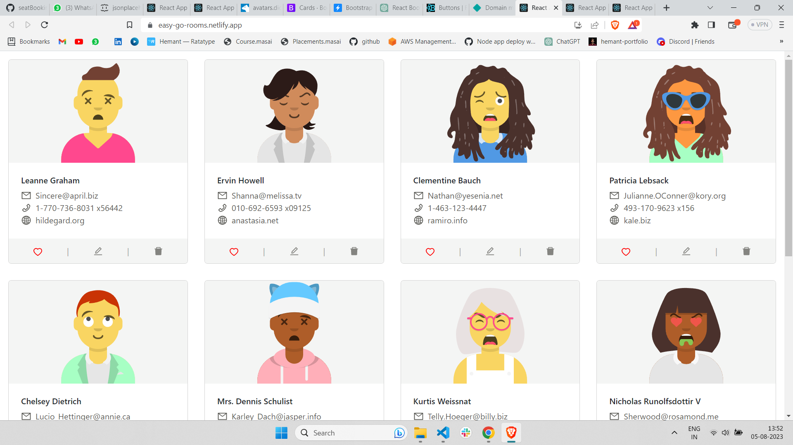
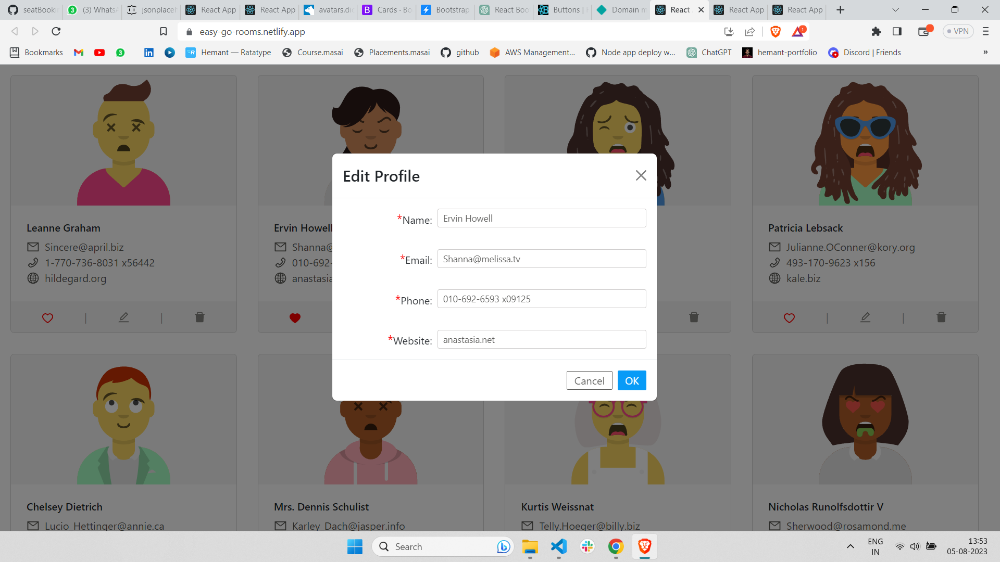

# Profile Display and Editing App

This is a simple React app that displays user profiles fetched from a remote API and allows users to edit profile information.

## Table of Contents

- [Profile Display and Editing App](#profile-display-and-editing-app)
  - [Table of Contents](#table-of-contents)
  - [Description](#description)
  - [Features](#features)
  - [Demo](#demo)
  - [Installation](#installation)
  - [Usage](#usage)
  - [Technologies Used](#technologies-used)
  - [Contributing](#contributing)
  - [License](#license)
  - [Contact](#contact)

## Description

This application fetches user profiles from the [JSONPlaceholder](https://jsonplaceholder.typicode.com/) API and displays them in a card format. Users can view user details such as name, email, phone, and website. Additionally, users can like/unlike user profiles and edit their profile information.

## Features

- Display user profiles in cards with name, email, phone, and website information.
- Allow users to like/unlike user profiles.
- Edit user profile information using a modal form.

## Demo
here is the demp of the application

modal form on which  user can edit the profile 

this is the live demo link of the project  `https://easy-go-rooms.netlify.app/`
## Installation

1. Clone the repository to your local machine.
2. Navigate to the project directory.
3. Run `npm install` to install the required dependencies.

## Usage

1. Run `npm start` to start the development server.
2. Open your browser and navigate to `http://localhost:3000` to view the app.

## Technologies Used

- React.js
- React Bootstrap
- Axios (for API requests)

## Contributing

Contributions are welcome! If you find any bugs or have suggestions for improvements, please open an issue or create a pull request.

## License

[Specify the license under which your project is released. For example, you can use MIT, Apache, or any other open-source license.]

## Contact

If you have any questions or need further assistance, feel free to contact me:

- Email: [hemantjayas03@gmail.com]
- GitHub: [hemantjayas]

---
Feel free to customize this template with your specific project information and add more sections if needed. The README is an essential part of your project, as it helps users and potential contributors understand your application and its features. Happy coding!
